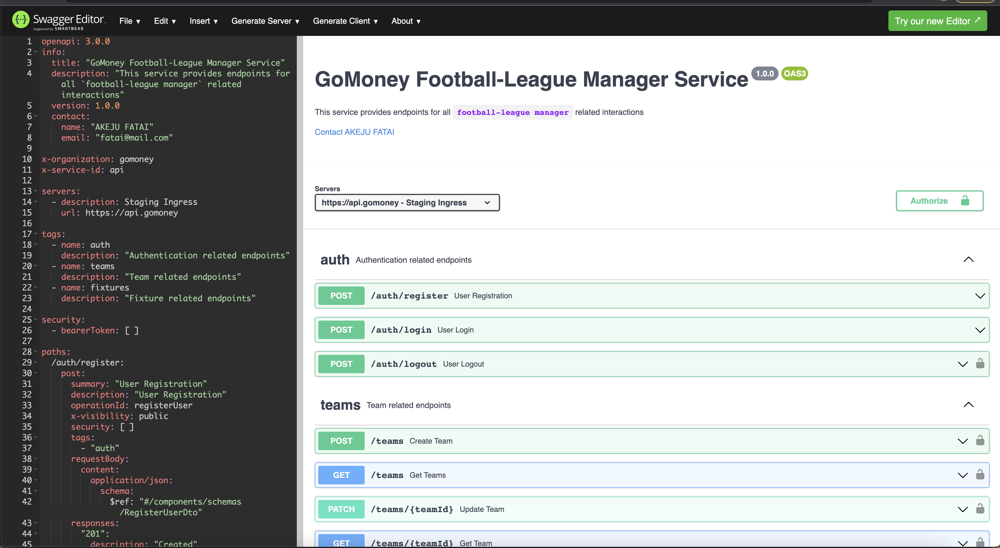

## GOMONEY BACK-END ASSESSMENT
```
Football League Manager to manage Teams & Fixtures.
```

## PROBLEM STATEMENT
```
N/A
```

## TOOLS USED
- NodeJs (Express)
- Typescript (Programming language)
- MongoDB (NoSQL database)
- Redis (Caching)
- Docker
- Postman
- Supertest & Jest (Testing)

## ASSUMPTIONS
- Fixture `status` only changes when a fixture-update has `match-result` (Status changes from `PENDING` to `COMPLETED`)

## OPTIMIZATIONS
- N/A

## IMPROVEMENTS
- API Versioning
- Add constraints of maximum number of teams that can be added within a League
- Logic to switch fixture status to IN_PROGRESS or ONGOING

## POSTMAN DOCUMENTATION (PUBLIC URL)
```
https://www.postman.com/punk1234/workspace/public-akeju/collection/25312024-1073d896-9171-48c6-a02e-05d1b8cfccbe?action=share&creator=25312024
```

## API-SPEC DISPLAY

